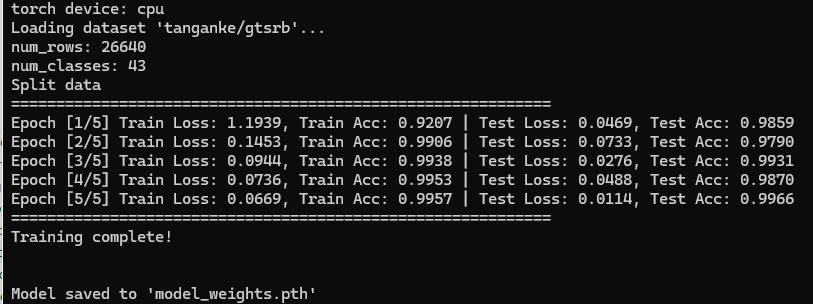
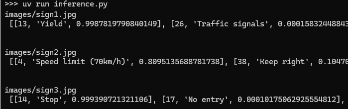
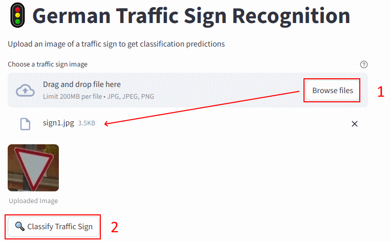
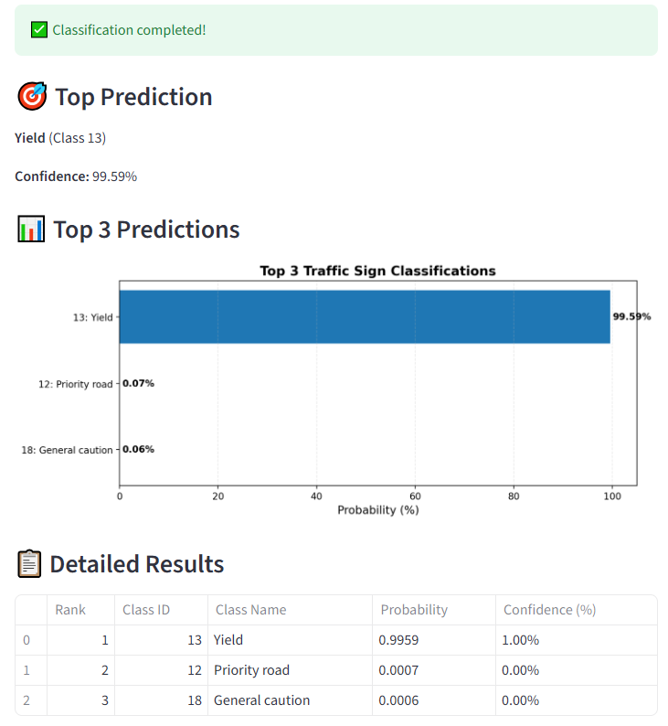

# GTSRB Traffic Sign Classification Project

A complete machine learning project for classifying traffic signs using PyTorch, with a FastAPI backend and Streamlit frontend.

## Motivation and Long‑Term Vision

This traffic sign classification project was chosen as a part of a larger personal pet project focused on intelligent road scene understanding. The current goal is to build a solid, production‑ready classifier for individual traffic sign images using the GTSRB dataset, exposed via an API and a simple web interface.
​

As a next step, the plan is to extend this work from pure classification to full traffic sign detection on arbitrary images. Instead of assuming a single centered sign, the future pipeline should detect and localize all traffic signs present in an input image using bounding boxes or other annotation formats.
​

After achieving robust image‑level detection, the longer‑term objective is to apply the same ideas to video streams. The aim is to process video files frame by frame, perform traffic sign detection over time, and experiment with tracking and temporal consistency of the detected signs.

## Dataset

The project uses the GTSRB (German Traffic Sign Recognition Benchmark) dataset from HuggingFace:
- Dataset: `tanganke/gtsrb`
- Classes: 43 different traffic sign classes
- Image size: Original images are ~32x32 pixels, resized to 224x224 for training

### Model choice

During experimentation, all supported architectures (`ResNet18/34/50`, `MobileNetV3-Small/Large`, and `EfficientNet-B0`) showed very similar classification quality on the GTSRB dataset, with only minor differences in final accuracy. 

Because of this, the final model was selected primarily based on efficiency and deployment constraints rather than raw accuracy and it's `MobileNetV3_Small`


For real‑time traffic sign classification on mobile or low‑power devices, `MobileNetV3` (Small or Large, depending on your accuracy needs) is generally the best balance of `light + fast + accurate`, with `EfficientNet‑B0` as a good alternative if you can afford slightly more compute.

## Project Structure

```
german-traffic-sign-recognition/
├── notebook.ipynb          # Jupyter notebook for experiments
├── train.py                # Training script with ONNX export
├── inference.py            # Make an inference for fitted model
├── app.py                  # FastAPI backend service
├── streamlit_app.py        # Streamlit frontend application
├── Dockerfile.backend      # Docker configuration for backend
├── Dockerfile.frontend     # Docker configuration for frontend
├── docker-compose.yml      # Docker Compose configuration for both services
├── dockerhub-compose.yml   # Docker Compose configuration with ready-to-run images from Docker Hub
├── pyproject.toml          # Project dependencies (uv)
├── README.md               # This file

```

## Features

- **Training**: Train `ResNet18/34/50`, `MobileNetV3 (Large/Small)`, or `EfficientNet` models on GTSRB dataset
- **ONNX Export**: Automatically export trained models to ONNX format for production
- **REST API**: FastAPI backend for serving predictions
- **Web Interface**: Streamlit frontend with interactive image upload and visualization
- **Docker Support**: Containerized backend and frontend services via docker-compose
- **Modern Tooling**: Uses `uv` for fast dependency management

## How to reproduce this project?

Clone the repository:

```bash
git clone https://github.com/Avisprof/german-traffic-sign-recognition
cd german-traffic-sign-recognition
```

### Using Pre-built Docker Images

Instead of building images locally, you can use the ready-to-run images from Docker Hub:

Pull the latest images:

```bash
docker compose -f dockerhub-compose.yml pull
```

Start services with Docker Compose:

```bash
docker compose -f dockerhub-compose.yml up -d
```

Access the application:
- **Backend** (FastAPI) on `http://localhost:8080`
- **Frontend** (Streamlit) on `http://localhost:8501`


## Installation from scratch

This project uses [uv](https://github.com/astral-sh/uv) for fast Python package management.

### 1. Install uv

```bash
pip install uv
```

### 2. Install Dependencies

```bash
uv sync --all-groups
```

This will install all dependencies from `pyproject.toml` into your current environment.

## Project Reproduction Steps

### Step 1: Train the Model

Train a model on the GTSRB dataset. The script will automatically:
- Download the dataset from HuggingFace
- Split into train/validation/test sets
- Train the model with data augmentation
- Save the best PyTorch checkpoint
- Export the model to ONNX format

Training `MobileNetV3_Small` (by default)
```bash
uv run python train.py
```


Training `MobileNetV3_Large`
```bash
uv run python train.py mobilenet_v3_large
```

Training `EfficientNet`
```bash
uv run python train.py efficientnet_b0
```

Training `ResNet18`
```bash
uv run python train.py resnet18
```

Training `ResNet34`
```bash
uv run python train.py resnet34
```

Training `ResNet50`
```bash
uv run python train.py resnet50
```

After training, you should see:
- `model_{MODEL_NAME}_weights.pth` - PyTorch checkpoint
- `model_gtsr.onnx` - ONNX model for inference

Run inference with ONNX model:
```bash
uv run inference.py
```



### Step 2: Start Backend and Frontend Services

#### Option A: Run with Docker Compose (Recommended)

This will start both backend and frontend services:

```bash
docker-compose up --build
```

This will start:
- **Backend** (FastAPI) on `http://localhost:8080`
- **Frontend** (Streamlit) on `http://localhost:8501`

The frontend is automatically configured to connect to the backend service.

#### Option B: Run Services Directly

**Start Backend:**

```bash
uv run python app.py
```

The backend will start on `http://localhost:8080`

**Start Frontend (in another terminal):**

```bash
uv run streamlit run streamlit_app.py
```

The frontend will open in your browser at `http://localhost:8501`

**Note**: Make sure the ONNX model file `model_gtsr.onnx` exists before starting the backend.

### Step 3: Use the Application

1. Open the Streamlit app in your browser
2. Upload a traffic sign image (JPG, JPEG, or PNG)
3. Click "Classify Traffic Sign"



4. View the top-3 predictions with probabilities displayed as a horizontal bar chart



