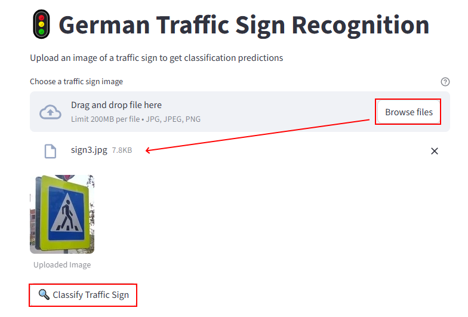
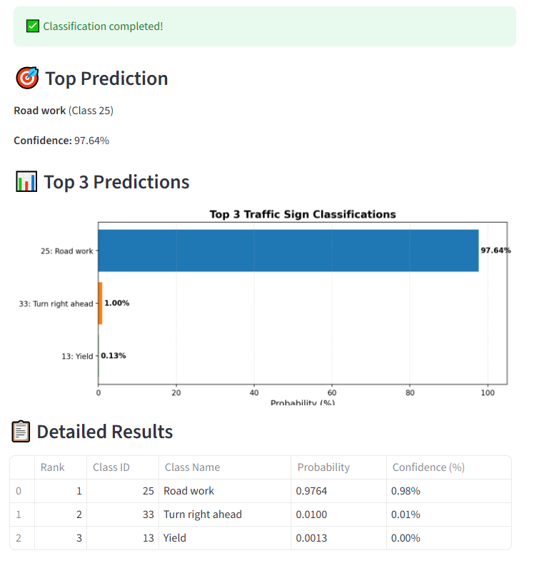

# GTSRB Traffic Sign Classification Project

A complete machine learning project for classifying traffic signs using PyTorch, with a FastAPI backend and Streamlit frontend.

## Dataset

The project uses the GTSRB (German Traffic Sign Recognition Benchmark) dataset from HuggingFace:
- Dataset: `tanganke/gtsrb`
- Classes: 43 different traffic sign classes
- Image size: Original images are ~32x32 pixels, resized to 224x224 for training

## Project Structure

```
german-traffic-sign-recognition/
├── train.py                # Training script with ONNX export
├── app.py                  # FastAPI backend service
├── streamlit_app.py        # Streamlit frontend application
├── Dockerfile.backend      # Docker configuration for backend
├── Dockerfile.frontend     # Docker configuration for frontend
├── docker-compose.yml      # Docker Compose configuration for both services
├── pyproject.toml          # Project dependencies (uv)
├── README.md               # This file
├── notebook.ipynb          # Jupyter notebook for experiments


## Features

- **Training**: Train ResNet18/34/50, MobileNetV3, or EfficientNet models on GTSRB dataset
- **ONNX Export**: Automatically export trained models to ONNX format for production
- **REST API**: FastAPI backend for serving predictions
- **Web Interface**: Streamlit frontend with interactive image upload and visualization
- **Docker Support**: Containerized backend and frontend services via docker-compose
- **Modern Tooling**: Uses `uv` for fast dependency management

## Installation

This project uses [uv](https://github.com/astral-sh/uv) for fast Python package management.

### 1. Install uv

```bash
pip install uv
```

### 2. Install Dependencies

```bash
uv pip install -e .
```

This will install all dependencies from `pyproject.toml` into your current environment.

## Project Reproduction Steps

### Step 1: Train the Model

Train a model on the GTSRB dataset. The script will automatically:
- Download the dataset from HuggingFace
- Split into train/validation/test sets
- Train the model with data augmentation
- Save the best PyTorch checkpoint
- Export the model to ONNX format

```bash
uv run python train.py
```


After training, you should see:
- `model_weights.pth` - PyTorch checkpoint
- `model_gtsr.onnx` - ONNX model for inference

### Step 2: Start Backend and Frontend Services

#### Option A: Run with Docker Compose (Recommended)

This will start both backend and frontend services:

```bash
docker-compose up --build
```

This will start:
- **Backend** (FastAPI) on `http://localhost:8080`
- **Frontend** (Streamlit) on `http://localhost:8501`

The frontend is automatically configured to connect to the backend service.

#### Option B: Run Services Directly

**Start Backend:**

```bash
uv run python app.py
```

The backend will start on `http://localhost:8080`

**Start Frontend (in another terminal):**

```bash
uv run streamlit run streamlit_app.py
```

The frontend will open in your browser at `http://localhost:8501`

**Note**: Make sure the ONNX model file `model_gtsr.onnx` exists before starting the backend.

### Step 3: Use the Application

1. Open the Streamlit app in your browser
2. Upload a traffic sign image (JPG, JPEG, or PNG)
3. Click "Classify Traffic Sign"



4. View the top-3 predictions with probabilities displayed as a horizontal bar chart



### Interactive API Docs

Once the backend is running, visit:
- Swagger UI: `http://localhost:8080/docs`
- ReDoc: `http://localhost:8080/redoc`